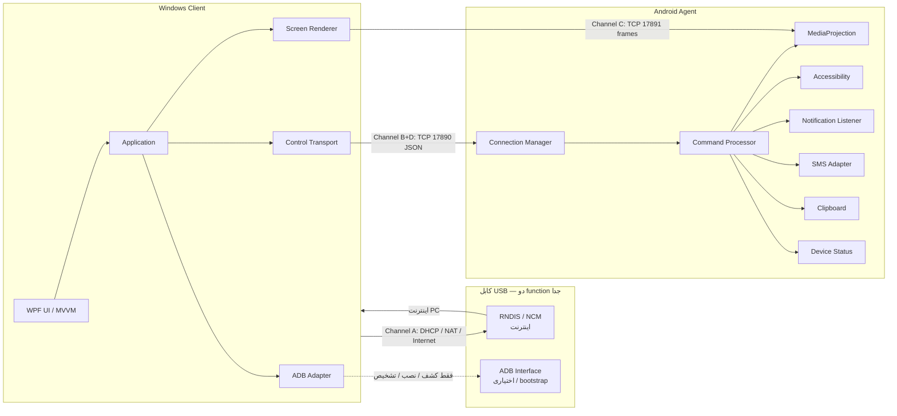

# معماری Phone Control Suite

## 1. هدف

کاربر گوشی را با کابل USB به ویندوز وصل می‌کند، **USB Tethering** را برای اینترنت کامپیوتر روشن می‌کند، و هم‌زمان یک UI ویندوزی صفحهٔ گوشی را نشان می‌دهد و ورودی موس/کیبورد را به گوشی می‌فرستد. اعلان، پیامک مجاز، کلیپ‌بورد و وضعیت دستگاه هم روی ویندوز دیده می‌شوند.

کنترل گوشی **نباید** USB Tethering را قطع یا USB function را عوض کند.

## 2. دیاگرام کلی



## 3. جداسازی کانال‌ها

| کانال | نقش | حمل‌ونقل | قانون |
| --- | --- | --- | --- |
| A. USB Tethering | اینترنت ویندوز | RNDIS/NCM روی USB | هرگز USB mode را عوض نکن؛ هرگز RNDIS را unbound نکن |
| B. Control | Touch، کلید، Back/Home | TCP روی IP تترینگ گوشی | از ADB به‌عنوان تنها مسیر استفاده نکن |
| C. Screen | فریم تصویر | TCP باینری جدا | قطع استریم نباید تترینگ را بشکند |
| D. Data | اعلان، SMS، کلیپ‌بورد، وضعیت | همان اتصال کنترل، type جدا | دادهٔ حساس در Log نرود |

جزئیات جریان: [`usb-tethering-and-control-channels.md`](usb-tethering-and-control-channels.md).

## 4. چرا TCP روی RNDIS مسیر اصلی کنترل است؟

وقتی USB tethering روشن می‌شود، بسیاری از OEMها USB gadget را به `rndis` (بدون `adb`) سوییچ می‌کنند. اگر کنترل فقط روی ADB باشد، با روشن شدن اینترنت، کانال کنترل می‌میرد — دقیقاً خلاف هدف این پروژه.

با tethering، گوشی معمولاً DHCP می‌دهد و خودش `192.168.42.129` است. ویندوز روی همان subnet یک IP می‌گیرد. Agent روی `0.0.0.0:17890` گوش می‌دهد. کلاینت ویندوز به IP gateway تترینگ وصل می‌شود. این ترافیک **روی همان RNDIS** است و function USB را تغییر نمی‌دهد.

ADB نقش مکمل دارد:

- تشخیص serial / مدل / نسخه وقتی interface موجود است
- نصب APK
- تشخیص اینکه آیا `rndis,adb` هم‌زمان فعال است یا نه
- **هرگز** اجرای `adb usb`، reboot، یا `svc usb setFunctions` در مسیر عادی

## 5. لایه‌های Windows Client

```
Desktop (WPF)  →  Application (use-cases)  →  Domain (interfaces)
                                               ↑
                    Infrastructure / Adb / Protocol / Screen / Input / Notifications
```

UI منطق کسب‌وکار ندارد. ADB، شبکه، فایل‌سیستم و ساعت پشت Interface هستند تا بدون گوشی تست شوند.

## 6. لایه‌های Android Agent

```
app  →  feature-*  →  core-data / core-network / core-permissions
                         ↓
                    core-domain (JVM، بدون Android SDK در logic خالص)
```

سرویس‌های طولانی‌مدت Foreground هستند، با Notification واضح.

## 7. Pairing و اعتماد

1. کاربر Agent را باز می‌کند و Pairing را شروع می‌کند.
2. گوشی یک کد ۶ رقمی (یا QR) نشان می‌دهد.
3. ویندوز کد را وارد می‌کند.
4. دو طرف یک `pairingId` و secret می‌سازند.
5. Session بعدی با HMAC روی handshake ثابت می‌کند که همان جفت است.
6. TLS در Phase 7 روی همین handshake سوار می‌شود.

Secret در ویندوز با DPAPI و در اندروید با EncryptedSharedPreferences ذخیره می‌شود. Plaintext ممنوع است.

## 8. وضعیت اتصال

`Disconnected → Connecting → PairingRequired → Connected`

از Connected: `Reconnecting` در قطع موقت، `Error` در شکست غیرقابل بازیابی.

Heartbeat هر ۵ ثانیه. Timeout پیش‌فرض ۱۵ ثانیه. Reconnect نمایی تا سقف تنظیم‌شده.

## 9. استریم صفحه

- Phase 2: اسکرین‌شات JPEG روی کانال C (یا ADB screencap به‌عنوان fallback موقت، بدون تغییر USB).
- Phase 4: MediaProjection + Foreground Service + فریم‌های JPEG/VP8.
- بعداً: H.264 hardware encoder (MediaCodec) بدون عوض کردن قرارداد metadata.

Metadata روی کنترل: `width`, `height`, `rotation`, `codec`, `fps`, `bitrate`.

## 10. ورودی

مختصات پنجرهٔ WPF با حفظ نسبت تصویر و letterbox به پیکسل منطقی گوشی نگاشت می‌شود. Accessibility gesture مسیر اصلی Tap/Swipe است. `input tap` از طریق ADB فقط fallback است و نباید USB را reset کند.

## 11. چیزهایی که معماری ادعا نمی‌کند

- باز کردن قفل PIN / Password / Biometric از راه دور
- Capture اپ‌های `FLAG_SECURE` (بانک‌ها و مشابه)
- آرشیو کامل SMS روی همهٔ نسخه‌های اندروید بدون Default SMS App
- کلیپ‌بورد در پس‌زمینه روی Android 10+ بدون محدودیت
- کنترل بدون Accessibility و بدون رضایت MediaProjection

جدول محدودیت‌ها: [`android-limitations.md`](android-limitations.md).
